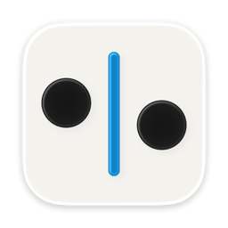
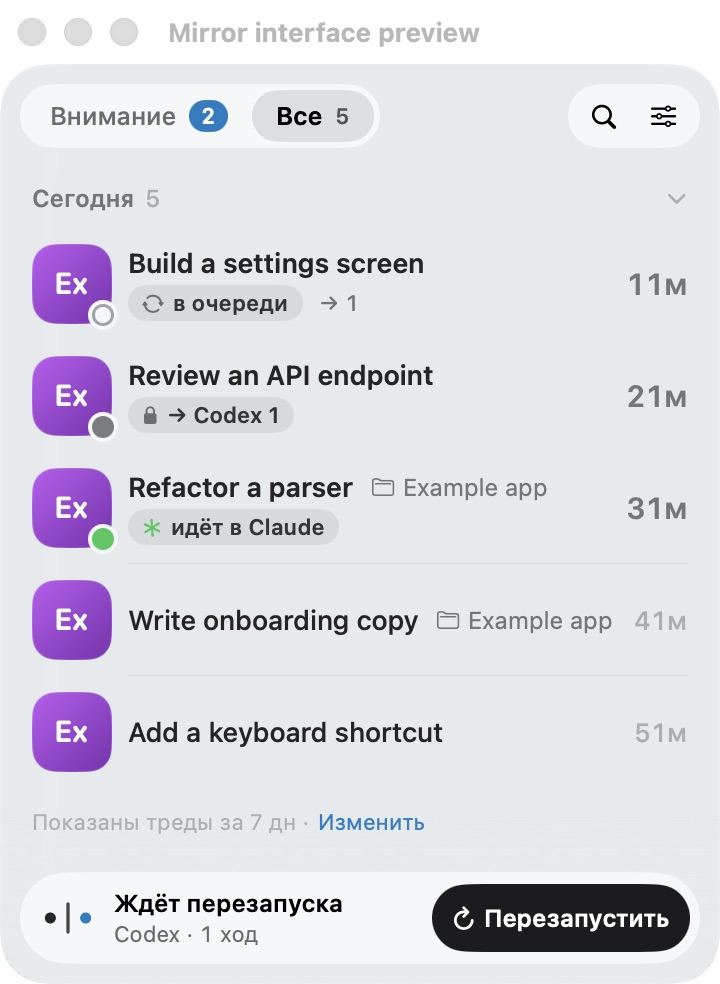

# Mirror — Codex ↔ Claude Code chat sync for macOS

**Switch coding agents. Keep the conversation.**

Mirror is a free, open-source macOS menu bar app that syncs local conversations between OpenAI Codex and Anthropic Claude Code. Continue a Codex chat in Claude Code, or a Claude Code session in Codex, with messages and supported tool history.

[Build and install](#build-and-install) · [FAQ](#faq) · [Report a bug](https://github.com/safintimur/mirror/issues)

> **Experimental beta · macOS 26+**
>
> Mirror writes to the local conversation stores used by both apps. Their formats can change between updates. Back up your chats before your first sync. Mirror is an independent project and is not affiliated with OpenAI or Anthropic.



*Native interface with example conversations. The current UI is in Russian.*

## What it does

- Creates a conversation in the other app and transfers completed turns in both directions.
- Carries over messages and supported command, file-change and tool-call records.
- Shows queued work, active conversations and sync errors from the menu bar.
- Supports manual synchronization and optional automatic synchronization.
- Queues work while a conversation is locked; the restart flow can close an app, sync, and reopen it.
- Mirrors manual titles and archive/unarchive changes. Deletion is represented by archiving on the other side.

Changes may need an app restart before they appear in its sidebar. Forks and sessions continued under a new ID are separate conversations. Not every provider-specific record has an equivalent in the other app.

## Continue a conversation in another app

1. Finish the current turn in Codex or Claude Code.
2. Open Mirror from the menu bar, review the queue, and sync. If an app holds a conversation lock, use Mirror's restart-and-sync flow; it warns about active sessions before closing anything.
3. Open the mirrored conversation in the other app and continue there. Mirror transfers conversation history; each provider still uses its own account and usage limits.

Manual sync works with automatic sync disabled. Enable automatic synchronization in Settings if you prefer background updates.

## Build and install

There is no hosted binary release yet. Building from source requires:

- macOS 26 or later; Codex and Claude Code installed and used at least once.
- Python 3.9+ available at `/usr/bin/python3` for the menu bar app. Python is not bundled yet.
- Xcode 26+ with Swift 6.2+ to build the native app and Icon Composer assets.
- Disable Codex's built-in Claude import before using Mirror to avoid duplicate conversations.

```sh
git clone https://github.com/safintimur/mirror.git
cd mirror
./app/build.sh
```

The result is `app/build/Mirror.app`. Copy it to Applications and open it. New installations start with automatic sync disabled; review the queue and run the first sync manually. Settings control automatic sync and idle restarts independently.

Local builds are **ad-hoc signed and not notarized**. macOS may block a downloaded copy; review the source and publisher before allowing it in Privacy & Security.

## FAQ

### Why is a chat waiting, or missing from the other app's sidebar?

An open session can hold a writer lock, and desktop apps can cache their conversation lists. Mirror queues blocked work. Its restart-and-sync flow closes the relevant app, applies queued changes, and reopens it. Provider updates can change local formats; see the [engine details](docs/ENGINE.ru.md) for compatibility limits.

### Does Mirror upload my conversations?

Mirror has no remote synchronization service or telemetry. It reads local conversation stores and uses the installed Codex app-server. Codex and Claude retain their own network behavior. See [data locations](docs/DEVELOPMENT.md#local-data) for the directories Mirror accesses.

### Does this sync regular Claude chats or cloud-only Codex tasks?

Mirror works with local Codex and Claude Code sessions, including Claude desktop's Code session registry. It does not sync ordinary Claude web chats or Codex tasks that exist only in the cloud.

## Help and development

[Developer guide](docs/DEVELOPMENT.md) · [Engine details (Russian)](docs/ENGINE.ru.md) · [Release process](docs/RELEASING.md).

When reporting a bug, include app versions and the error message. Remove prompts, tool output, local paths and credentials from any logs you share. Do not attach your chat databases or transcripts.

## License

[MIT](LICENSE), copyright © 2026 Timur Safin.
